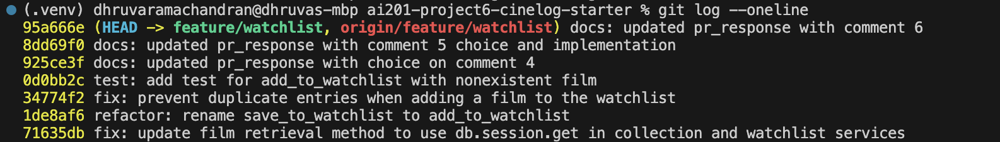

# PR Response Doc — CineLog Watchlist Feature

## AI Usage
<!-- Fill in at the end — how you used AI tools during this project -->

## Comment 1 — Rename
**What I did**
I simply used Cmd + Shift + H to find all occurences of "save_to_watchlist" in the repo, and replaced it with "add_to_watchlist"
**How I verified:**
I used the same command to search for any occurences of save_to_watchlist, and found nothing, so it was successfully replaced.

## Comment 2 — Deduplication
**What I did:**
**How I verified:**


## Comment 3 — Missing test
**What I did:**
I created test_watchlist.py, and the necessary test, test_add_to_collection_nonexistent_film_raises. It asserts that add_to_watchlist raises an error for an invalid UUID.
**How I verified:**
I made sure to run the test suite, and it passed all tests.

## Comment 4 — Default visibility
**My position:**
The default visibility of watchlists should indeed be private, instead of public.
**Reasoning:**
When a user creates a new watchlist, they may not immediately want to share it. It might be something more personal or secret, and by defaulting to public, that is now shared. In the case they do want to share it, keeping the option open allows for it.
**Tradeoff acknowledged:**
If the purpose of this app is to be extremely social and to share watchlists, then having an extra step of changing the visibility can introduce friction. Ultimately, the design decision has to do with the core goal of the app, but defaulting to private is the safer option.

## Comment 5 — Sort order
**My position:**
Watchlists and Collections should both use the Alphabetical sort order.
**Reasoning:**
In both cases, a user may want to search for a paticular entry in the set. In that case, looking through the alphabetical positioning of the title is much easier than try to remember when you added it to the watchlist or collection. This option would make for a smoother user experience.
**Engagement with reviewer's point:**
While keeping the date added sort does help from a history perspective, I maintain my position that having it be easier to locate an entry takes precedence. I can understand that it might be benificial to see the most recent entry first, since that is the one most likely to be the one the user is searching for, but it is only the better option in that case.

## Comment 6 — Rebase
**What conflicted:**
There were actually no conflicts when I rebased to origin. It seems like the repo was changed unintentionally by someone else.
**How I resolved it:**
Nothing had to be changed since there were no conflicts
**How I verified no conflict remains:**
After running the rebase command, I got a message saying it was successfully rebased.

## PR Description
<!-- Written at the end — feature overview, design decisions, manual testing steps -->

### What this PR does

Adds a watchlist feature to CineLog: users can save films they intend to watch later, separate from their collection of films they've already watched. It introduces a `WatchlistEntry` model, `services/watchlist_service.py` (`add_to_watchlist`, `get_watchlist`), and two endpoints:

- `GET /watchlist/<user_id>` — returns all films on a user's watchlist, sorted alphabetically by title
- `POST /watchlist/<user_id>/add` — adds a film to a user's watchlist (body: `{ "film_id": <id> }`)

Adding a film that doesn't exist raises `FilmNotFoundError`; adding a film already on the watchlist raises `AlreadyOnWatchlistError` rather than creating a duplicate entry.

### Design decisions

- **Visibility default (Comment 4):** `WatchlistEntry.public` defaults to `False`. A user's list of films they intend to watch is more personal than their collection of films they've watched, so new entries start private and the user can opt in to sharing rather than opt out.
- **Sort order (Comment 5):** Both `get_watchlist` and `get_collection` sort alphabetically by film title, rather than by date added. This makes it easier to locate a specific entry in a list that can grow large, at the cost of not surfacing the most recently added film first.

### Manual testing steps

1. Install dependencies and start the app:
   ```bash
   pip install -r requirements.txt
   python app.py
   ```
2. Create a user and a film to test with (no seed data or creation endpoints exist yet, so this is done directly against the app's database):
   ```bash
   python3 -c "
   from app import create_app, db
   from models import User, Film
   app = create_app()
   with app.app_context():
       user = User(username='reviewer', email='reviewer@example.com')
       film = Film(title='Paddington 2', year=2017, genre='Comedy')
       db.session.add_all([user, film])
       db.session.commit()
       print('USER_ID', user.id)
       print('FILM_ID', film.id)
   "
   ```
3. Confirm the watchlist starts empty:
   ```bash
   curl http://localhost:5000/watchlist/<USER_ID>
   # => []
   ```
4. Add the film to the watchlist:
   ```bash
   curl -X POST http://localhost:5000/watchlist/<USER_ID>/add \
     -H "Content-Type: application/json" \
     -d '{"film_id": <FILM_ID>}'
   # => 201, entry JSON with "public": false
   ```
5. Confirm it now appears in the watchlist, with the film's details attached and `public` set to `false`:
   ```bash
   curl http://localhost:5000/watchlist/<USER_ID>
   # => [{ "title": "Paddington 2", ..., "public": false }]
   ```
6. Add a second film with an earlier alphabetical title and confirm it's returned first, verifying the alphabetical sort order.

## git log --oneline

